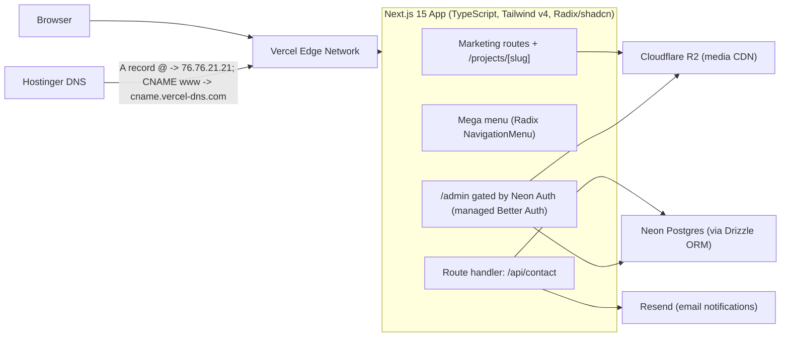

# Afronovation Rebuild - Knowledge Base

> The living brain of this project. If a decision, fact, or convention matters, it lives here. Update this file whenever a decision changes.

| | |
|---|---|
| **Project** | afronovation.com rebuild |
| **Client** | Afronovation, Inc. (127 Long Shadow Ln., Cary, NC 27518 - hello@afronovation.com - 1-844-664-4247) |
| **Current platform** | WordPress on Hostinger (see `audit_report.md`) |
| **Target platform** | Next.js on Vercel; domain and DNS stay at Hostinger |
| **Created** | July 28, 2026 |
| **Status** | Phase 0 - documentation and scripts (no code executed yet) |

---

## 1. Project Goals

1. Replace the WordPress site with a modern, fast, conversion-focused Next.js application.
2. Preserve all verified content (copy, team bios, testimonials, contact details) from the audit as the single source of truth.
3. Introduce a mega menu with placeholder slots for multiple future project case studies.
4. Capture leads through a staged contact form: store in Neon Postgres, notify via Resend.
5. Serve optimized media from Cloudflare R2.
6. Eliminate the current platform's security, scalability, and duplication defects (audit Sections 9-11).
7. Cut over DNS at Hostinger from the WordPress origin to Vercel with a rollback path.

## 2. Non-Goals (for now)

- No blog/CMS publishing workflow (Phase 5 adds a minimal admin for projects/testimonials/team only).
- No e-commerce, client portal, or authenticated end-user features.
- No real-time features.
- No visual identity rebrand (logo, name, and core messaging stay; layout and UI are modernized).

---

## 3. Target Architecture

Request flows:

- **Page views:** statically rendered marketing pages served from Vercel's edge; images via `next/image` against R2 public URLs.
- **Lead capture:** staged form -> `/api/contact` -> zod validation -> insert into `contact_submissions` (Drizzle -> Neon) -> Resend notification to hello@afronovation.com -> success state.
- **Admin (Phase 5):** `/admin` -> Neon Auth session check -> CRUD over projects/testimonials/team tables -> images uploaded to R2 via S3-compatible API.

## 4. Stack Decisions and Rationale

| Layer | Decision | Rationale |
|---|---|---|
| Framework | Next.js 15 (App Router) | Static-first marketing pages plus serverless route handlers in one deploy; first-class Vercel support |
| Language | TypeScript (strict) | Typed content module prevents copy drift (the audit's duplication defects) |
| Styling | Tailwind CSS v4 | Token-driven design system; fast iteration |
| Components | shadcn/ui on Radix primitives | Accessible mega menu (NavigationMenu), Dialog, Accordion out of the box; code is owned, not a runtime dependency |
| Database | Neon Postgres (serverless) | Serverless driver fits Vercel functions; branching for preview environments |
| ORM | Drizzle ORM + drizzle-kit | Lightweight, SQL-first, great TS inference; migrations as code |
| Auth | Neon Auth (managed Better Auth) | Managed credentials for the future /admin area without self-hosting auth infra |
| Media | Cloudflare R2 | S3-compatible, zero egress fees; replaces the un-CDN'd wp-content library |
| Email | Resend | Simple transactional API for lead notifications from the route handler |
| Hosting | Vercel | Edge network, preview deploys, analytics; native Next.js |
| DNS/registrar | Hostinger | Domain stays where it is; only A/CNAME records change at cutover |
| Analytics | Vercel Analytics + custom events | Conversion tracking for CTAs, form steps, mega-menu engagement |

---

## 5. Information Architecture

### 5.1 Routes

| Route | Purpose | Source content |
|---|---|---|
| `/` | Conversion home: hero + trust bar, capabilities, services grid, selected engagements preview, testimonials preview, team preview, CTA | audit Sections 2.1, 3, 4, 5 |
| `/about/` | Story, values, full team section | audit Sections 2.2, 3 |
| `/services/` | Three practice areas with key-services detail | audit Section 2.3 |
| `/services/[slug]/` (optional, Phase 2 stretch) | One page per practice area | audit Sections 2.2/2.3 capability copy |
| `/projects/` | Index of placeholder project cards | content module (new) |
| `/projects/[slug]/` | Case-study template (placeholder state: scope/sector/outcome slots + "case study coming soon") | content module (new) |
| `/testimonials/` | Testimonials + partner/client logo wall | audit Sections 2.5, 5 |
| `/contact/` | Staged lead form + direct contact details | audit Section 6 |
| `/privacy/` and `/terms/` (new) | Legal pages required for lead capture | stakeholder-provided text |
| `/admin/` (Phase 5) | Gated management of projects, testimonials, team | - |
| Legacy redirects | `/hello-world/`, `/feed/`, `/author/*` -> `/` (410 or redirect); `/Contact/` -> `/contact/` | audit Section 1.2 |

### 5.2 Mega menu (Radix NavigationMenu)

| Panel | Contents |
|---|---|
| **Services** | Three practice areas, each linking to `/services/` anchor (or `/services/[slug]`), with key-services sub-lists; featured CTA card ("Book a consultation") |
| **Projects** | Grid of 3-6 placeholder project cards (image slot, title, sector, one-line outcome) + "View all projects" link |
| **Company** | About, Team, Testimonials, Contact |

Behavior: sticky header; persistent primary CTA button on the right at all scroll positions; keyboard and screen-reader accessible; `prefers-reduced-motion` respected; mobile uses a full-screen drawer (Radix Dialog) with accordions mirroring the panels.

### 5.3 Conversion system

- One primary CTA site-wide: consultation/contact (final label is a stakeholder decision: "Book a consultation" vs "Get in touch").
- Hero: outcome-led headline (from verified tagline), dual CTA, partner-logo trust bar (Oracle, Cisco, Microsoft, AWS, AfDB, African Union, Smart Africa, Zensar).
- Social proof: testimonial carousel, stat placeholders (stakeholders to supply real numbers).
- Every page ends with the unified CTA section; long pages add one mid-page inline CTA.
- Staged (2-step) contact form: step 1 identity (name, email, phone, company), step 2 needs (interests, preferred contact method, message, consent) - reduces abandonment while preserving the audit's 8-field spec.
- Analytics events: `cta_click`, `form_step_complete`, `form_submit`, `megamenu_open`.

---

## 6. Content Model

### 6.1 Single source of truth

All marketing copy lives in typed modules under `app/src/content/` (created in Phase 2). Rules:

- Every repeated element is defined once: shared CTA, practice areas, service lists, team bios, testimonials, partner logos, contact details.
- Copy text comes from `audit_report.md` Sections 2-6 verbatim; corrections listed in Section 11 of this file are applied only after stakeholder sign-off.
- No copy strings inside components; components import from the content module.

### 6.2 Content entities (TypeScript shapes)

- `PracticeArea`: slug, name, tagline, description, keyServices[]
- `Service`: name, practiceAreaSlug
- `TeamMember`: slug, name, role, bio, credentials[], headshot (R2 key + alt), linkedinUrl (nullable), sortOrder
- `Testimonial`: quote, author, role, company, confirmed (boolean - false until stakeholders verify, see Section 11)
- `Project`: slug, title, sector, scope, outcome (metric slot, nullable), summary, image (R2 key + alt), status (`placeholder` | `draft` | `published`), featured (mega-menu visibility)
- `PartnerLogo`: name, image (R2 key), url (nullable)
- `ContactDetails`: address, email, phone (single definition, referenced everywhere)

### 6.3 Database schema (Drizzle, Neon Postgres)

Phase 3 table (lead capture):

- `contact_submissions`: id (uuid, pk), full_name, email, phone, company (nullable), interests (text array), preferred_contact_method, message (nullable), consent (boolean), status (`new` default), source (`contact-form`), created_at

Phase 5 tables (admin-managed content; mirror the TS entities above):

- `team_members`, `testimonials`, `projects` - columns mirror Section 6.2 plus `updated_at`, `created_at`
- Better Auth managed tables (user, session, account, verification) are created by the auth migration, not hand-written.

## 7. Environment Variable Registry

All values are placeholders until keys are provided. Master template: `.env.example`. Runtime file: `app/.env.local` (never committed).

| Variable | Used by | Where to get it |
|---|---|---|
| `DATABASE_URL` | Drizzle/Neon | Neon console -> project -> connection string (pooled) |
| `NEON_AUTH_BASE_URL` | Neon Auth | Neon console -> Auth page |
| `BETTER_AUTH_SECRET` | Auth session signing | Generate locally (32+ random chars) |
| `BETTER_AUTH_URL` | Auth callbacks | `http://localhost:3000` dev / production URL |
| `R2_ACCOUNT_ID` | R2 S3 client | Cloudflare dashboard -> R2 |
| `R2_ACCESS_KEY_ID` | R2 S3 client | Cloudflare R2 -> Manage API tokens |
| `R2_SECRET_ACCESS_KEY` | R2 S3 client | Same |
| `R2_BUCKET_NAME` | R2 S3 client | e.g. `afronovation-media` |
| `R2_PUBLIC_URL` | next/image srcs | R2 public bucket URL or custom domain (e.g. `https://media.afronovation.com`) |
| `RESEND_API_KEY` | Resend | Resend dashboard -> API Keys |
| `CONTACT_FROM_EMAIL` | Resend sender | Verified sender/domain in Resend |
| `CONTACT_TO_EMAIL` | Lead notification target | `hello@afronovation.com` |
| `NEXT_PUBLIC_SITE_URL` | SEO/canonical | `https://afronovation.com` |

---

## 8. Vendor & Account Checklist

| Vendor | Account needed | Setup milestone | Status |
|---|---|---|---|
| Neon | Postgres project + Auth enabled | Before Phase 3 | Pending (keys later) |
| Cloudflare | R2 bucket + API token + public access (or custom domain) | Before Phase 4 | Pending |
| Resend | API key + verified sending domain (`afronovation.com`) | Before Phase 3 | Pending |
| Vercel | Team/project, CLI login | Phase 6 | Pending |
| Hostinger | hPanel DNS access (already owns domain) | Phase 6 cutover | Available |

Note: Resend domain verification requires adding DKIM/SPF records in Hostinger DNS - do this before the cutover so lead email works on day one (see `docs/rebuild-guide.md`).

## 9. Security Baseline (requirements for the rebuild)

Directly answers audit Section 9:

- Set all security headers app-wide in Next.js config: HSTS (`max-age=63072000; includeSubDomains; preload`), `X-Frame-Options: DENY`, `X-Content-Type-Options: nosniff`, `Referrer-Policy: strict-origin-when-cross-origin`, `Permissions-Policy` (deny camera/mic/geolocation), and a real Content-Security-Policy once asset domains stabilize.
- No user-enumeration surface: no public user API, no author archive redirects, admin routes return 404 (not 401 hints) when unauthenticated.
- Contact form: server-side zod validation, consent required, honeypot field + per-IP rate limiting (Upstash or Vercel KV - decided at Phase 3), no data echoed back in responses.
- Auth: managed by Neon Auth; session cookies only (no tokens in localStorage); `/admin` checks session server-side.
- Secrets only in environment variables; `.env.local` git-ignored; Vercel env vars for production.
- Publish `/privacy/` and `/terms/` before launch (the form collects PII with a consent checkbox - the policy must exist).
- Dependency hygiene: pinned versions, `pnpm audit` in CI (backlog Phase 6).

## 10. Performance Budget (requirements for the rebuild)

Directly answers audit Section 10:

- LCP < 2.5s on 4G for every marketing page; CLS < 0.1; INP < 200ms.
- All raster images through `next/image` with explicit `sizes`; WebP/AVIF automatic via the image optimizer.
- No image wider than its largest rendered size + 2x DPR headroom (the audit's 2560px-logo-in-118px-slot defect must be impossible).
- Fonts: self-hosted via `next/font`, 2 families max, subset.
- Marketing pages statically rendered (SSG); only `/api/contact` and `/admin` run as functions.
- Per-page JS budget: < 200KB gzipped on marketing routes.
- Media served from R2 behind a public URL (custom domain `media.afronovation.com` optional in Phase 4).

---

## 11. Open Questions for Stakeholders

Carried from the audit; resolve before the content module is finalized (Phase 2):

| # | Question | Context |
|---|---|---|
| Q1 | Confirm name spelling "Justin Fawson" | Homepage shows "justing fawson"; About shows "Justin fawson" (audit Section 3) |
| Q2 | Adrienne Boykin's LinkedIn/profile URL | Her "more." link is a `#` placeholder everywhere (audit Section 3) |
| Q3 | Are the three testimonials real, anonymized, or placeholders? | "Globex" and "Initech" are fictional theme-demo companies; two different people are both "CEO Of Globex" (audit Section 5) |
| Q4 | Approve corrected form option "Government Digitalization" | Current option reads "Government Digitaization" (audit Section 6.3) |
| Q5 | Approve copy fix "reimagining" | Testimonials intro reads "rei-magining" (audit Section 2.5) |
| Q6 | Which portraits do `Screenshot-2025-09-10-192436.png` and `...-192300.png` depict? | Unattributed 27x-px screenshots in the media library (audit Section 7.1) |
| Q7 | Provide real engagement data for project placeholders | Sector, scope, outcome metrics for 3-6 "Selected engagements" (audit Section 4) |
| Q8 | Provide privacy policy and terms text | No legal pages exist today (audit Section 1.3) |
| Q9 | Company social profiles (real LinkedIn company page, etc.) | Footer LinkedIn icon is `href=""`; contact page icons are share buttons only (audit Section 2.6) |
| Q10 | Primary CTA label: "Book a consultation" vs "Get in touch" | Drives hero + sticky header (knowledgebase Section 5.3) |

## 12. Conventions

- **Folders (repo root):** `audit_report.md`, `knowledgebase.md`, `backlog.md`, `docs/` (guides), `scripts/` (PowerShell setup), `app/` (the Next.js application, created by `scripts/01-scaffold.ps1`).
- **App structure:** `app/src/app` (routes), `app/src/components` (ui + sections), `app/src/content` (typed copy), `app/src/lib` (clients), `app/src/db` (schema + client).
- **Naming:** kebab-case files, PascalCase components, camelCase functions; content entities per Section 6.2.
- **TypeScript:** strict mode; no `any` in committed code; zod for all external input.
- **Commits:** Conventional Commits (`feat:`, `fix:`, `chore:`, `docs:`).
- **Docs:** any decision change updates this file first, then the backlog.
- **Secrets:** never in git; `.env.example` documents every variable with placeholders.

## 13. Document Map

| File | Role |
|---|---|
| `audit_report.md` | Frozen record of the current site - content + platform findings |
| `knowledgebase.md` (this file) | Living decisions, architecture, conventions |
| `backlog.md` | Prioritized execution plan (Phases 0-6) |
| `docs/rebuild-guide.md` | Operator runbook: scripts, keys, DNS cutover |
| `README.md` | Project overview and doc index |
| `.env.example` | Environment variable template |
| `scripts/00-06*.ps1` | Idempotent PowerShell setup scripts (run only after keys arrive) |

## Changelog

| Date | Change |
|---|---|
| 2026-07-28 | Initial knowledge base created from audit + approved plan (mega menu, conversion-focused redesign, Vercel hosting with Hostinger DNS) |
