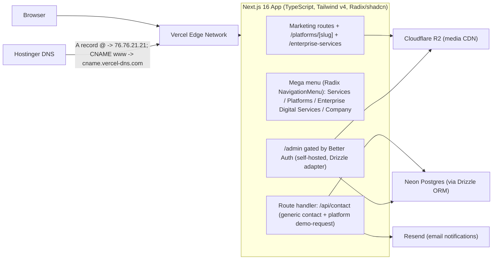

# Afronovation Rebuild - Knowledge Base

> The living brain of this project. If a decision, fact, or convention matters, it lives here. Update this file whenever a decision changes.

| | |
|---|---|
| **Project** | afronovation.com rebuild |
| **Client** | Afronovation, Inc. (127 Long Shadow Ln., Cary, NC 27518 - hello@afronovation.com - 1-844-664-4247) |
| **Current platform** | WordPress on Hostinger (see `audit_report.md`) |
| **Target platform** | Next.js on Vercel; domain and DNS stay at Hostinger |
| **Created** | July 28, 2026 |
| **Status** | Phase 2 - Dark Conversion Redesign implemented (Enterprise Digital Services + Platforms ecosystem) |
| **Design direction** | Dark-forward, stat-driven, conversion-focused (Stripe / Daba Finance / Azumo / EmbassyOS synthesis) - see Section 5.4 |

---

## 1. Project Goals

1. Replace the WordPress site with a modern, fast, conversion-focused Next.js application.
2. Preserve all verified content (copy, team bios, testimonials, contact details) from the audit as the single source of truth.
3. Introduce a mega menu with placeholder slots for multiple future project case studies.
4. Capture leads through a staged contact form: store in Neon Postgres, notify via Resend.
5. Serve optimized media from Cloudflare R2.
6. Eliminate the current platform's security, scalability, and duplication defects (audit Sections 9-11).
7. Cut over DNS at Hostinger from the WordPress origin to Vercel with a rollback path.

## 2. Non-Goals (for now)

- No blog/CMS publishing workflow (Phase 5 adds a minimal admin for platforms/testimonials/team only).
- No e-commerce, client portal, or authenticated end-user features.
- No real-time features.
- No EN/FR i18n, lead-magnet PDF, newsletter capture, live chat, or Vercel Analytics yet (deferred - see `dark_conversion_redesign` plan "Deferred to a later phase").

> Superseded: the original "no visual identity rebrand" non-goal was explicitly reversed by stakeholder direction - see Section 5.4 (Dark Conversion Redesign) and the wordmark/icon-mark decision in Section 12.

---

## 3. Target Architecture

Request flows:

- **Page views:** statically rendered marketing pages served from Vercel's edge; images via `next/image` against R2 public URLs (falls back to `app/public/media-staging/` locally until `R2_PUBLIC_URL` is set).
- **Lead capture (generic):** staged form -> `/api/contact` -> zod validation (`contactFormSchema`) -> insert into `contact_submissions` (Drizzle -> Neon) -> Resend notification to hello@afronovation.com -> success state.
- **Demo request (per platform):** single-step `DemoRequestForm` on every `/platforms/[slug]#demo` -> same `/api/contact` route, disambiguated by a `formType: "demo-request"` discriminant and validated against `demoRequestSchema` -> same `contact_submissions` table, with `platform_slug`, `organization_type`, `inquiry_type`, and `utm_*` columns populated.
- **Admin (Phase 5):** `/admin` -> Better Auth session check -> CRUD over platforms/testimonials/team tables -> images uploaded to R2 via S3-compatible API.

## 4. Stack Decisions and Rationale

| Layer | Decision | Rationale |
|---|---|---|
| Framework | Next.js 16 (App Router) | Static-first marketing pages plus serverless route handlers in one deploy; first-class Vercel support |
| Language | TypeScript (strict) | Typed content module prevents copy drift (the audit's duplication defects) |
| Styling | Tailwind CSS v4 | Token-driven design system; fast iteration |
| Components | shadcn/ui on Radix primitives | Accessible mega menu (NavigationMenu), Dialog, Accordion out of the box; code is owned, not a runtime dependency |
| Database | Neon Postgres (serverless) | Serverless driver fits Vercel functions; branching for preview environments |
| ORM | Drizzle ORM + drizzle-kit | Lightweight, SQL-first, great TS inference; migrations as code |
| Auth | Better Auth (self-hosted, Drizzle adapter) | Decided over Neon-managed Auth for Phase 5 `/admin`: `BETTER_AUTH_SECRET` is self-generated, `NEON_AUTH_BASE_URL`/`NEON_AUTH_JWKS_URL` are retained for verification only |
| Media | Cloudflare R2 | S3-compatible, zero egress fees; replaces the un-CDN'd wp-content library |
| Email | Resend | Simple transactional API for lead notifications from the route handler |
| Hosting | Vercel | Edge network, preview deploys, analytics; native Next.js |
| DNS/registrar | Hostinger | Domain stays where it is; only A/CNAME records change at cutover |
| Analytics | Deferred (Vercel Analytics + custom events) | Natural fit once the Vercel project exists at deploy time - see Deferred Enhancements in `backlog.md` |

---

## 5. Information Architecture

### 5.1 Routes

| Route | Purpose | Source content |
|---|---|---|
| `/` | Conversion home: dark hero + stat bar, who-we-serve, capabilities, methodology badges, problem/solution contrast, engagement process, flagship platform spotlight, Enterprise Digital Services teaser, partner logo marquee, testimonial carousel, team preview, FAQ, CTA | audit Sections 2.1, 3, 4, 5 + Section 5.4 below |
| `/about/` | Story, values, full team section | audit Sections 2.2, 3 |
| `/services/` | Three advisory practice areas with key-services detail | audit Section 2.3 |
| `/enterprise-services/` (new) | Catalog of all 18 Bridge* Enterprise Digital Services, grouped into 5 categories, with "Used by" chips and Roadmap badges | `app/src/content/enterprise-services.ts` |
| `/platforms/` (replaces `/projects/`) | Index of the 8 mission-specific platforms; EmbassyOS pinned first as the flagship | `app/src/content/platforms.ts` |
| `/platforms/[slug]/` (replaces `/projects/[slug]/`) | Canonical case-study template (At a Glance, Challenge, Opportunity, Approach, Highlights, Service Architecture, Expected Impact, Who It Serves, Scalability, Demo request) | `app/src/content/platforms.ts` |
| `/testimonials/` | Testimonials + partner/client logo wall | audit Sections 2.5, 5 |
| `/contact/` | Staged lead form + direct contact details | audit Section 6 |
| `/privacy/` and `/terms/` | Real, drafted legal copy (no longer a "pending legal review" stub) | drafted in Phase 2 |
| `/admin/` (Phase 5) | Gated management of platforms, testimonials, team | - |
| `/sitemap.xml`, `/robots.txt` | Next.js file-convention SEO routes | `app/src/app/sitemap.ts`, `robots.ts` |
| Legacy redirects | `/projects` -> `/platforms`; `/projects/:slug` -> `/platforms` (permanent); WordPress-era `/hello-world/`, `/feed/`, `/author/*` -> `/` | `app/next.config.ts` `redirects()` |

### 5.2 Mega menu (Radix NavigationMenu)

| Panel | Contents |
|---|---|
| **Services** | Three practice areas, each linking to `/services/` anchor, with key-services sub-lists; featured CTA card ("Get in touch") |
| **Platforms** | EmbassyOS flagship spotlight (badge, external "Visit embassyos.com" link) at top, then 3 other featured platforms (Bridge55, Civis, Souvera Intelligence Terminal), then "View all platforms" |
| **Enterprise Digital Services** | 5 category headers (Travel & Mobility, Identity/Trust/Security, Intelligence & Data, Platform Operations & Integration, Commerce & Engagement), 2-3 example services each, then "View full catalog" |
| **Company** | About, Team, Testimonials, Contact |

Behavior: sticky glass header; persistent primary "Get in touch" CTA button on the right at all scroll positions; keyboard and screen-reader accessible; `prefers-reduced-motion` respected; mobile uses a full-screen drawer (Radix Dialog) with accordions mirroring all four panels.

### 5.3 Conversion system

- One primary CTA site-wide: "Get in touch" (hero, header, footer, mid-page CTAs).
- Hero: outcome-led headline (verified tagline), dual CTA (Get in touch / View platforms), dark gradient-mesh background, decorative "live catalog" dashboard card, dynamic stat readout (platform/service/practice-area counts pulled directly from the content module so they can never drift out of sync with the data).
- Social proof: infinite partner-logo marquee, testimonial carousel with avatar + arrows (Embla).
- Every page ends with the unified `CtaSection`; every `/platforms/[slug]/` page additionally ends in a platform-specific `DemoRequestForm` (`#demo` anchor).
- Staged (2-step) generic contact form unchanged (identity, then needs); demo-request form is a lighter single-step variant (name/email/phone/org type/inquiry type/message), sharing the same `/api/contact` route and `contact_submissions` table via a `formType` discriminant.
- FAQ section with `FAQPage` JSON-LD for rich-result eligibility.

### 5.4 Design language (Dark Conversion Redesign)

Reference synthesis: Stripe and EmbassyOS (dark navy base, gradient-mesh glows, bold stat counters), Daba Finance (numbered process steps, testimonial carousel), Azumo (icon-categorized mega menu, text-based wordmark + simple "a" icon mark).

- **Theme:** single dark-forward theme (no light/dark toggle) - near-black navy background, warm off-white foreground, gold/amber `primary` (brand/CTA color), teal/emerald `accent` (secondary highlight), defined as oklch tokens in `app/src/app/globals.css`.
- **Brand identity:** raster WordPress logo replaced by a `Wordmark` component (lowercase "afronovation" with a gold leading "a") and a code-generated (`next/og` `ImageResponse`) rounded-square "a" icon mark for favicon/apple-icon/manifest - no binary logo assets checked in.
- **Utilities:** `bg-gradient-mesh` (hero/CTA backgrounds), `bg-radial-glow` (spotlight cards), `stat-number` (gradient big numbers), `badge-roadmap` (Future-service / Target-outcome pill), `skip-link` (a11y).
- **Ecosystem framing:** Afronovation is positioned as an *Enterprise Platform Company* - a catalog of reusable **Enterprise Digital Services** (Bridge* microservices) composed into **Mission-Specific Platforms** (full case studies). See Section 6.4-6.5.

---

## 6. Content Model

### 6.1 Single source of truth

All marketing copy lives in typed modules under `app/src/content/` (created in Phase 2). Rules:

- Every repeated element is defined once: shared CTA, practice areas, service lists, team bios, testimonials, partner logos, contact details.
- Copy text comes from `audit_report.md` Sections 2-6 verbatim; corrections listed in Section 11 of this file are applied only after stakeholder sign-off.
- No copy strings inside components; components import from the content module.

### 6.2 Content entities (TypeScript shapes)

- `PracticeArea`: slug, name, tagline, description, keyServices[]
- `Service`: name, practiceAreaSlug
- `TeamMember`: slug, name, role, bio, credentials[], headshot (R2 key + alt), linkedinUrl (nullable), sortOrder
- `Testimonial`: quote, author, role, company, confirmed (boolean - false until stakeholders verify, see Section 11)
- `PartnerLogo`: name, image (R2 key), url (nullable)
- `ContactDetails`: address, email, phone (single definition, referenced everywhere)
- `EnterpriseService` (new, replaces nothing - additive): slug, name, category, description, usedBy[], status (`available` | `roadmap`)
- `EnterpriseServiceCategory` (new): slug, name, tagline - the 5 groupings in `app/src/content/enterprise-services.ts`
- `Platform` (new, **replaces `Project`**): slug, name, tagline, summary, sector, status (`operational` | `flagship` | `upcoming`), featured, externalUrl (nullable - EmbassyOS only), image (R2 key + alt), atAGlance, challenge, opportunity, approach, highlights[], poweredBy (EnterpriseService slugs), expectedImpact[] (`{ label, targetOutcome: boolean }`), whoItServes (`{ primary[], secondary[], decisionMakers[] }`), scalability
- `ProcessStep` (new): step, title, description, methodologyTag - the 4-step Discover/Design/Deliver/Sustain engagement method
- `Methodology` (new): code, name - the PMP/PROSCI/Agile/SAFe/Lean/CISM trust badges
- `FaqItem` (new): question, answer
- `AudienceSegment` (new): slug, label, pitch, ctaLabel, ctaHref - the "Who We Serve" homepage strip

### 6.3 Database schema (Drizzle, Neon Postgres)

Phase 3 table (lead capture, extended in Phase 2 redesign for demo requests):

- `contact_submissions`: id (uuid, pk), full_name, email, phone, company (nullable), interests (text array, **nullable** - unused by demo requests), preferred_contact_method (**nullable** - unused by demo requests), message (nullable), consent (boolean), status (`new` default), source (`contact-form` | `demo-request`), **`platform_slug`, `organization_type`, `inquiry_type`, `utm_source`, `utm_medium`, `utm_campaign` (all nullable, new)**, created_at

Phase 5 tables (admin-managed content; mirror the TS entities above):

- `team_members`, `testimonials`, **`platforms`** (renamed from `projects`; columns mirror the `Platform` shape's flat fields - slug, name, tagline, summary, sector, status, featured, external_url, image_key, image_alt - the richer case-study fields stay content-module-only until a Phase 5 admin editor is scoped) plus `updated_at`, `created_at`
- Better Auth managed tables (user, session, account, verification) are created by the auth migration, not hand-written.

### 6.4 Enterprise Digital Services catalog (18 services, 5 categories)

Canonical source: stakeholder-provided "Afronovation Enterprise Digital Services" brief (2026-07-29). Categories and counts:

| Category | Services |
|---|---|
| Travel & Mobility (6) | BridgeAir, BridgeStay, BridgeMobility, BridgeExperience, BridgePackages, BridgeVisa |
| Identity, Trust & Security (4) | BridgeVault, BridgeWallet, BridgeProtect, BridgeIdentity *(Roadmap)* |
| Intelligence & Data (3) | BridgeAI, BridgeInsight, BridgeAnalytics *(Roadmap)* |
| Platform Operations & Integration (3) | BridgeAPI, BridgeComm, BridgeAdmin |
| Commerce & Engagement (2) | BridgeMarketing, BridgePayments *(Roadmap)* |

Each service's `usedBy[]` is copied verbatim from the stakeholder brief and cross-referenced into each platform's `poweredBy[]` in `platforms.ts` - this is the mechanism that keeps every `/platforms/[slug]` "Enterprise Service Architecture" section factually consistent with the catalog.

### 6.5 Mission-specific platforms (7 case studies + 1 forward-looking callout)

| Platform | Status | Notes |
|---|---|---|
| Bridge55 | Operational, featured | Integrated travel platform |
| **EmbassyOS** | **Flagship**, featured | Confirmed live at [embassyos.com](https://embassyos.com) - only platform with `externalUrl` set |
| Civis | Operational, featured | Diaspora registration & intelligence |
| ElectionOS | Operational | Digital governance / elections |
| BridgeX | Operational | Cross-organization interoperability |
| Souvera Intelligence Terminal | Operational, featured | Confirmed real/affiliated per Ibrahima Kourouma's LinkedIn |
| Souvera Markets | Operational | Financial market intelligence |
| Future Platforms | N/A - not a case study | Rendered only as a closing CTA card (`futurePlatformsCallout` in `platforms.ts`) on `/platforms/`, not a full `[slug]` page |

Per stakeholder direction, all 7 real platforms are narrated as live/operational. Any specific numeric claim in `expectedImpact[]` is labeled `targetOutcome: true` (rendered as a "Target outcome" pill) since none has an independently verified figure yet - same integrity rule as the unconfirmed testimonials (Section 11, Q3).

## 7. Environment Variable Registry

All values are placeholders until keys are provided. Master template: `.env.example`. Runtime file: `app/.env.local` (never committed).

| Variable | Used by | Where to get it |
|---|---|---|
| `DATABASE_URL` | Drizzle/Neon (pooled) | Neon console -> project -> connection string (pooled) |
| `DATABASE_URL_UNPOOLED` | drizzle-kit migrations | Neon console -> connection string (direct/unpooled) |
| `NEON_AUTH_BASE_URL` | Reference only (kept for Neon Auth verification) | Neon console -> Auth page |
| `NEON_AUTH_JWKS_URL` | Reference only | Same page - **note:** the value labeled `NEON_AUTH_COOKIE_SECRET` in the vendor export is actually this JWKS endpoint URL, not a secret |
| `BETTER_AUTH_SECRET` | Self-hosted Better Auth session signing | Self-generated: `node -e "console.log(require('crypto').randomBytes(32).toString('hex'))"` |
| `BETTER_AUTH_URL` | Auth callbacks | `http://localhost:3000` dev / production URL |
| `R2_ACCOUNT_ID` | R2 S3 client | Cloudflare dashboard -> R2 |
| `R2_ACCESS_KEY_ID` | R2 S3 client | Cloudflare R2 -> Manage API tokens |
| `R2_SECRET_ACCESS_KEY` | R2 S3 client | Same |
| `R2_BUCKET_NAME` | R2 S3 client | `afronovation` (live bucket name) |
| `R2_API_TOKEN` | Reserved, not used by the S3 client today | Broader Cloudflare API token - future programmatic bucket config (e.g. enabling public access) |
| `R2_PUBLIC_URL` | next/image srcs (`media()` helper) | **Gap:** enable the free r2.dev Public Bucket URL in the Cloudflare dashboard (bucket `afronovation` -> Settings -> Public access -> Allow Access), then paste the `https://pub-<hash>.r2.dev` URL here. Until set, `media()` falls back to `app/public/media-staging/`. Custom domain (`media.afronovation.com`) deferred to the Phase 6 DNS cutover (see Q13). |
| `RESEND_API_KEY` | Resend | Resend dashboard -> API Keys |
| `CONTACT_FROM_EMAIL` | Resend sender | Using Resend's shared `onboarding@resend.dev` test sender until `afronovation.com` DKIM/SPF are verified (see `docs/rebuild-guide.md` Step 6) |
| `CONTACT_TO_EMAIL` | Lead + demo-request notification target | `hello@afronovation.com` |
| `NEXT_PUBLIC_SITE_URL` | SEO/canonical, sitemap, OG images | `https://afronovation.com` |

---

## 8. Vendor & Account Checklist

| Vendor | Account needed | Setup milestone | Status |
|---|---|---|---|
| Neon | Postgres project + Auth enabled | Before Phase 3 | **Live** - `contact_submissions` schema pushed 2026-07-29 (`drizzle-kit push`); Auth still self-hosted-pending (Phase 5) |
| Cloudflare | R2 bucket + API token + public access (or custom domain) | Before Phase 4 | Bucket/token live; public access not yet enabled (Q13) |
| Resend | API key + verified sending domain (`afronovation.com`) | Before Phase 3 | API key live; **sandbox-restricted** (see note below) |
| Vercel | Team/project, CLI login | Phase 6 | Pending |
| Hostinger | hPanel DNS access (already owns domain) | Phase 6 cutover | Available |

Note: Resend domain verification requires adding DKIM/SPF records in Hostinger DNS - do this before the cutover so lead email works on day one (see `docs/rebuild-guide.md`).

**Verified 2026-07-29:** an end-to-end test of `/api/contact` (both the generic contact form and a platform demo request) against the live Neon database succeeded - rows insert correctly into `contact_submissions`. The Resend send step failed with a 403 (`"You can only send testing emails to your own email address"`) because the Resend account is still in sandbox mode with no verified sending domain; `/api/contact` catches this and still returns `{ ok: true, warning: "email-deferred" }` so the lead is never lost. This is expected pre-launch and is resolved by the DKIM/SPF verification already tracked above - not a code defect.

## 9. Security Baseline (requirements for the rebuild)

Directly answers audit Section 9:

- Set all security headers app-wide in Next.js config: HSTS (`max-age=63072000; includeSubDomains; preload`), `X-Frame-Options: DENY`, `X-Content-Type-Options: nosniff`, `Referrer-Policy: strict-origin-when-cross-origin`, `Permissions-Policy` (deny camera/mic/geolocation), and a real Content-Security-Policy once asset domains stabilize.
- No user-enumeration surface: no public user API, no author archive redirects, admin routes return 404 (not 401 hints) when unauthenticated.
- Contact form: server-side zod validation, consent required, honeypot field + per-IP rate limiting (Upstash or Vercel KV - decided at Phase 3), no data echoed back in responses.
- Auth: managed by Neon Auth; session cookies only (no tokens in localStorage); `/admin` checks session server-side.
- Secrets only in environment variables; `.env.local` git-ignored; Vercel env vars for production.
- Publish `/privacy/` and `/terms/` before launch (the form collects PII with a consent checkbox - the policy must exist).
- Dependency hygiene: pinned versions, `pnpm audit` in CI (backlog Phase 6).

## 10. Performance Budget (requirements for the rebuild)

Directly answers audit Section 10:

- LCP < 2.5s on 4G for every marketing page; CLS < 0.1; INP < 200ms.
- All raster images through `next/image` with explicit `sizes`; WebP/AVIF automatic via the image optimizer.
- No image wider than its largest rendered size + 2x DPR headroom (the audit's 2560px-logo-in-118px-slot defect must be impossible).
- Fonts: self-hosted via `next/font`, 2 families max, subset.
- Marketing pages statically rendered (SSG); only `/api/contact` and `/admin` run as functions.
- Per-page JS budget: < 200KB gzipped on marketing routes.
- Media served from R2 behind a public URL (custom domain `media.afronovation.com` optional in Phase 4).

---

## 11. Open Questions for Stakeholders

Carried from the audit; resolve before the content module is finalized (Phase 2):

| # | Question | Context |
|---|---|---|
| Q1 | Confirm name spelling "Justin Fawson" | Homepage shows "justing fawson"; About shows "Justin fawson" (audit Section 3) |
| Q2 | Adrienne Boykin's LinkedIn/profile URL | Her "more." link is a `#` placeholder everywhere (audit Section 3) |
| Q3 | Are the three testimonials real, anonymized, or placeholders? | "Globex" and "Initech" are fictional theme-demo companies; two different people are both "CEO Of Globex" (audit Section 5) |
| Q4 | Approve corrected form option "Government Digitalization" | Current option reads "Government Digitaization" (audit Section 6.3) |
| Q5 | Approve copy fix "reimagining" | Testimonials intro reads "rei-magining" (audit Section 2.5) |
| Q6 | Which portraits do `Screenshot-2025-09-10-192436.png` and `...-192300.png` depict? | Unattributed 27x-px screenshots in the media library (audit Section 7.1) |
| Q7 | Provide real engagement data for project placeholders | Sector, scope, outcome metrics for 3-6 "Selected engagements" (audit Section 4) |
| Q8 | Provide privacy policy and terms text | No legal pages exist today (audit Section 1.3) |
| Q9 | Company social profiles (real LinkedIn company page, etc.) | Footer LinkedIn icon is `href=""`; contact page icons are share buttons only (audit Section 2.6) |
| Q10 | Primary CTA label: "Book a consultation" vs "Get in touch" | **Resolved:** "Get in touch" (Dark Conversion Redesign, 2026-07-29) |
| Q11 | Trademark clearance for "BridgeX," "Civis," and "ElectionOS" | These exact names are already publicly used by unrelated products elsewhere (a crypto bridge protocol, a nonprofit consultation tool, and a campaign-CRM, respectively). Advisory only, not blocking - flagged before heavy public marketing push under these names |
| Q12 | Verified impact metrics per platform | All `expectedImpact[]` entries in `platforms.ts` are currently labeled `targetOutcome: true` pending real, verifiable figures for Bridge55, EmbassyOS, Civis, ElectionOS, BridgeX, and the two Souvera platforms |
| Q13 | R2 custom domain (`media.afronovation.com`) setup | Requires delegating that subdomain's DNS to Cloudflare via an NS record at Hostinger (R2 custom domains don't support partial/CNAME zones) - bundled into the Phase 6 DNS cutover so DNS is only touched once; `r2.dev` is the interim public URL (see Section 7) |

## 12. Conventions

- **Folders (repo root):** `audit_report.md`, `knowledgebase.md`, `backlog.md`, `docs/` (guides), `scripts/` (PowerShell setup), `app/` (the Next.js application, created by `scripts/01-scaffold.ps1`). `afronovation_APIs.md` holds real vendor credentials at the repo root and is git-ignored (never commit).
- **App structure:** `app/src/app` (routes), `app/src/components` (ui + sections + `home/` homepage sections + `brand/` wordmark), `app/src/content` (typed copy), `app/src/lib` (clients), `app/src/db` (schema + client).
- **Naming:** kebab-case files, PascalCase components, camelCase functions; content entities per Section 6.2 and 6.4-6.5.
- **Brand identity:** no raster logo files. The wordmark is a text component (`components/brand/wordmark.tsx`); the icon mark, apple-icon, and OG images are code-generated via `next/og` `ImageResponse` (`icon.tsx`, `apple-icon.tsx`, `opengraph-image.tsx`) - never hand-authored binary image assets.
- **TypeScript:** strict mode; no `any` in committed code; zod for all external input.
- **Commits:** Conventional Commits (`feat:`, `fix:`, `chore:`, `docs:`).
- **Docs:** any decision change updates this file first, then the backlog.
- **Secrets:** never in git; `.env.example` documents every variable with placeholders.

## 13. Document Map

| File | Role |
|---|---|
| `audit_report.md` | Frozen record of the current site - content + platform findings |
| `knowledgebase.md` (this file) | Living decisions, architecture, conventions |
| `backlog.md` | Prioritized execution plan (Phases 0-6) |
| `docs/rebuild-guide.md` | Operator runbook: scripts, keys, DNS cutover |
| `README.md` | Project overview and doc index |
| `.env.example` | Environment variable template |
| `scripts/00-06*.ps1` | Idempotent PowerShell setup scripts (run only after keys arrive) |

## Changelog

| Date | Change |
|---|---|
| 2026-07-28 | Initial knowledge base created from audit + approved plan (mega menu, conversion-focused redesign, Vercel hosting with Hostinger DNS) |
| 2026-07-29 | Dark Conversion Redesign implemented: real Neon/R2/Resend credentials wired into `app/.env.local`; dark-forward design tokens and text-based wordmark/icon-mark shipped; `/projects` replaced by `/platforms` (7 case studies + EmbassyOS flagship) and new `/enterprise-services` (18-service Bridge catalog in 5 categories); `contact_submissions` extended for platform demo requests; homepage rebuilt with stat bar, audience strip, methodology badges, comparison section, engagement process, flagship spotlight, logo marquee, testimonial carousel, and FAQ; SEO/trust pass added (dynamic OG images, JSON-LD, sitemap, robots, real Privacy/Terms copy, custom 404) |
